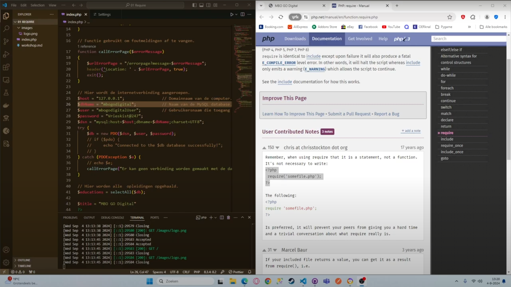

# Require workshop

**In deze workshop ga je oefenen met het ordenen van code in verschillende bestanden. We gebruiken de database connectie als voorbeeld.**

### 1. Bestudeer
[](https://youtube.com/playlist?list=PLRDVUEnDeEU68bXCC7sFmkYo8IHzOvFcy&feature=shared)
> Bestudeer deze video die uitlegt hoe require en include werken. **Let op! Ik probeer de video's onder de 10 minuten te houden. Is hier niet gelukt mijn excuses.**


### 2. Repository aanmaken op Github
> Maak een repository aan op Github.com met de naam "phpworkshops". Open de repository in Visual Studio Code. Gebruik Github Desktop.


### 3. TOP 5 PHP Extensions
> Ga opzoek naar de 5 beste extensies voor php in Visual Studio Code en installeer deze.


### 4. PHP Webserver starten
> Open de terminal in Visual Studio Code en start de terminal met het commando: "php -S localhost:8000".


### 5. Globale variable
> Maak een map **config** aan en maak hierin een bestand **db.conf.php** aan. Voeg de onderstaande code toe aan het bestand. **Type de code zelf, daar leer je het meeste van**
```php
<?php
$host = "localhost";            // Hostnaam databaseserver
$db = "phpworkshops";           // Naam database
$user = "phpworkshops";         // Gebruikersnaam database
$pass = "P1e3b0c44298fc1c149afbf4c8996fb92427ae41e4649b934ca495991b7852b855";
$charset = "utf8mb4";           // Meest gebruikte characterset voor MySQL.
```

### 6. Database en user aanmaken.
> Open PHPMyAdmin en maak de database "phpworkshops" aan. Maak ook de gebruiker aan met de gegevens zoals beschreven in de **db.conf.php** file. Je kunt dit ook met SQL doen? Probeer het met en zonder sql commando's.
```sql
CREATE DATABASE phpworkshops;
CREATE USER 'phpworkshopsUser'@'localhost' IDENTIFIED BY 'E@3b0c44298fc1c149afbf4c8996fb92427ae41e4649b934ca495991b7852b855';
GRANT ALL PRIVILEGES ON phpworkshops.* TO 'phpworkshopsUser'@'localhost' WITH GRANT OPTION;
FLUSH PRIVILEGES;
```

### 7. Database connectie aanmaken.
> Maak een map **database** aan in de root van de webserver en maak hierin een bestand **connection.php** aan. Zorg dat het bestand **db.conf.php** wordt binnengehaald met require. 

```php
// Voeg hier een require toe om de variabelen van het bestand db.conf.php te importeren.

<?php
$dsn = "mysql:host=$host;dbname=$db;charset=$charset";
$options = [
    PDO::ATTR_ERRMODE            => PDO::ERRMODE_EXCEPTION,
    PDO::ATTR_DEFAULT_FETCH_MODE => PDO::FETCH_ASSOC,
    PDO::ATTR_EMULATE_PREPARES   => false,
];

try {
    $pdo = new PDO($dsn, $user, $pass, $options);
} catch (\PDOException $e) {
    throw new \PDOException($e->getMessage(), (int)$e->getCode());
}
```

### 8. Comments (opmerkingen) toevoegen
> Voor op een professionele manier "comments" toe aan de code in het bestand **connection.php**. Leg in eigen woorden uit. Niet in de woorden van chatGPT.


### 9. Tabel users aanmaken
> Log in op MySQL en maak een tabel aan met de naam users en de velden zoals hieronder beschreven. Probeer het zonder gebruik te maken van het onderstaande commando.
```sql
CREATE TABLE user (
    id CHAR(36) PRIMARY KEY,
    username VARCHAR(50) NOT NULL,
    password VARCHAR(255) NOT NULL,
    email VARCHAR(100) NOT NULL,
    first_name VARCHAR(50),
    last_name VARCHAR(50),
    birth_date DATE,
    created_at TIMESTAMP DEFAULT CURRENT_TIMESTAMP,
    last_login TIMESTAMP DEFAULT CURRENT_TIMESTAMP ON UPDATE CURRENT_TIMESTAMP
);
```

### 10. Tabel users vullen
> Log in het PHPMyAdmin en vul de tabel met de onderstaande tien records.
```sql
INSERT INTO user (id, username, password, email, first_name, last_name, birth_date) VALUES
(UUID(), 'user1', 'password1', 'user1@example.com', 'John', 'Doe', '1990-01-01'),
(UUID(), 'user2', 'password2', 'user2@example.com', 'Jane', 'Smith', '1992-02-02'),
(UUID(), 'user3', 'password3', 'user3@example.com', 'Alice', 'Johnson', '1994-03-03'),
(UUID(), 'user4', 'password4', 'user4@example.com', 'Bob', 'Brown', '1996-04-04'),
(UUID(), 'user5', 'password5', 'user5@example.com', 'Charlie', 'Davis', '1998-05-05'),
(UUID(), 'user6', 'password6', 'user6@example.com', 'David', 'Miller', '2000-06-06'),
(UUID(), 'user7', 'password7', 'user7@example.com', 'Eve', 'Wilson', '2002-07-07'),
(UUID(), 'user8', 'password8', 'user8@example.com', 'Frank', 'Moore', '2004-08-08'),
(UUID(), 'user9', 'password9', 'user9@example.com', 'Grace', 'Taylor', '2006-09-09'),
(UUID(), 'user10', 'password10', 'user10@example.com', 'Hank', 'Anderson', '2008-10-10');
```

### 11. View users aanmaken
> Maak een map **views/users** aan in de root van de webserver en maak hierin een bestand **usertable.php** aan. Maak op deze pagina een tabel waarin alle gebruiker onder elkaar komen te staan.
```php
<?php
// Require om de database verbinding $pdo te importeren.
require "../../config/db.conf.php";
require "../../database/connection.php";

// SQL query om alle gebruikers op te halen
$sql = 'SELECT * FROM user';
$stmt = $pdo->query($sql);

// Maak hier een HTML-pagina aan om alle gebruikers netjes te laten zien.
// Hoe zorg je ervoor dat de gebruikers georderd worden op achternaam?
```

### 12. Controllerpagina users aanmaken
> Maak een map **users** aan in de root van de webserver en maak hierin een bestand **index.php** aan. Gebruik in de code een require om de view van het bestand **usertable.php** binnen te halen.

```php
// Voeg een require aan deze controller pagina toe om de view usertable.php aan te roepen. Als je nu in de browser http://localhost:8000/users aanroept krijg je de tabel met gebruikers.
```

### 13. View usertable.php opschonen
> Verplaats zoveel mogelijk php code van de view-pagina usertable.php naar de controller pagina users/index.php. Alleen de noodzakelijk php code mag overblijven in de view.


### 14. View voor toevoegen gebruiker toevoegen
> Maak een HTML-formulier aan het toevoegen van een nieuwe gebruiker. **Noem deze pagina view/users/userform.php**.


### 15. Controller pagina userform
> Maak een controllerpagina aan voor het aanroepen met het adres **admin/users/index.php**. Gebruik require om deze view aan te roepen. Net als bij onderdeel 12. 